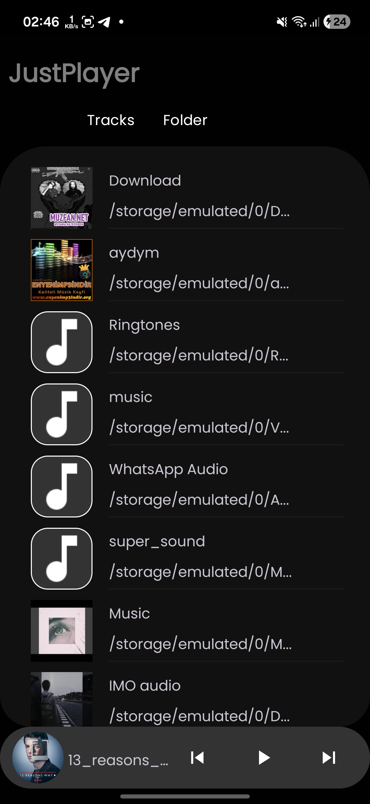
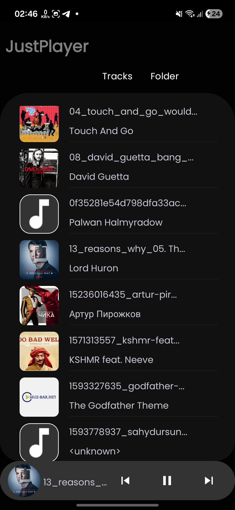
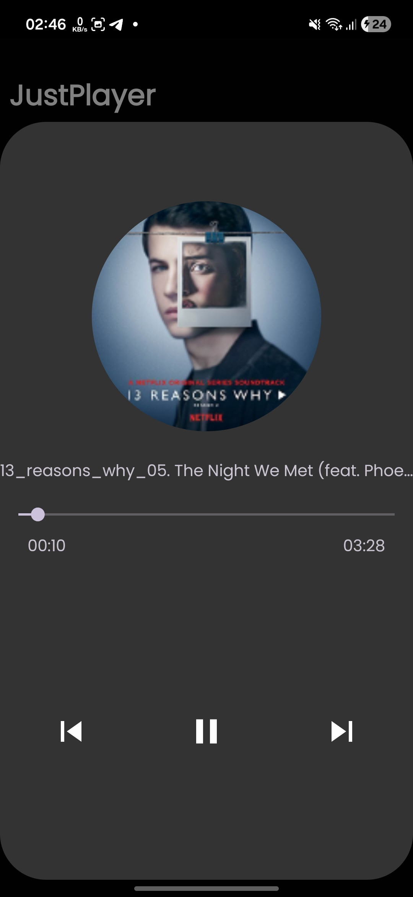

# 🎵 MusicPlayer App

A modern Android music player built with **Kotlin**, **Jetpack components**, and a clean architecture approach.  
The app supports background playback, notifications, headset controls, folder-based browsing, and more.

---

## 🚀 Features

- 🎧 **Play, Pause, Next, Previous** music controls  
- 🔊 **Foreground Music Service** with media session  
- 📁 **Folder-based music browser**  
- 🖼️ Reads **Images / Audio / Video** files using scoped permissions  
- 🔔 **Media-style notification** with playback controls  
- 🎙️ **Bluetooth headset button support**  
- 💾 Handles Android **13+ media permissions (READ_MEDIA_*)**  
- ⚙️ Built using:
  - Kotlin + Coroutines  
  - ViewModel + LiveData  
  - ViewBinding  
  - RecyclerView  
  - Foreground Service  
  - MediaSession + NotificationCompat  

---

<p float="left">
  
  
  
</p>

## 📱 Requirements

- **Minimum SDK:** 23  
- **Target SDK:** 34  
- **Android Studio:** Hedgehog or newer  

---

## 🛠️ Tech Stack

| Layer | Technologies |
|-------|--------------|
| UI | Fragment, ViewBinding, RecyclerView |
| Architecture | MVVM |
| Background | Foreground Service, MediaSession |
| Permissions | Runtime permissions (Android 13+) |
| Other | NotificationCompat, Bluetooth controls |

---

## 🔐 Permissions Used
- READ_MEDIA_AUDIO
- READ_MEDIA_IMAGES
- READ_EXTERNAL_STORAGE (≤ Android 32)
- BLUETOOTH / BLUETOOTH_ADMIN / BLUETOOTH_CONNECT
- FOREGROUND_SERVICE
- POST_NOTIFICATIONS
- MEDIA_CONTENT_CONTROL


---

### 📱 Download APK
[⬇️ Download Latest APK](app/src/main/res/raw/justplayer.apk)


## ▶️ How to Run

1. Clone the repository:

```bash
git clone https://github.com/durdyshev/MusicPlayer.git
